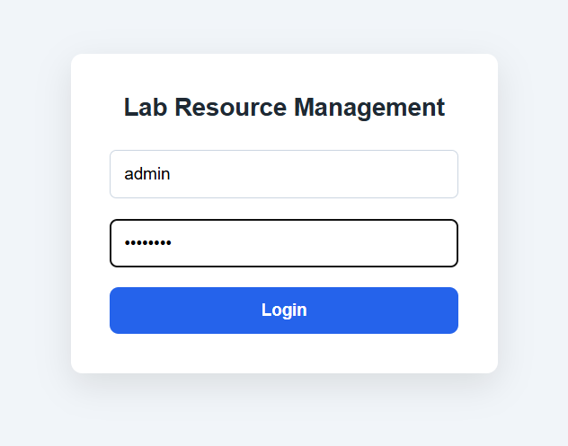
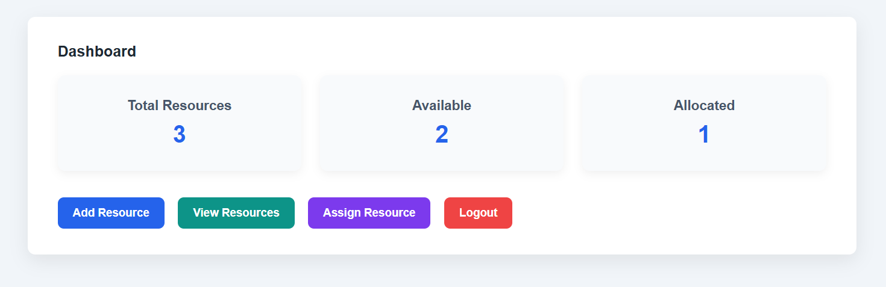
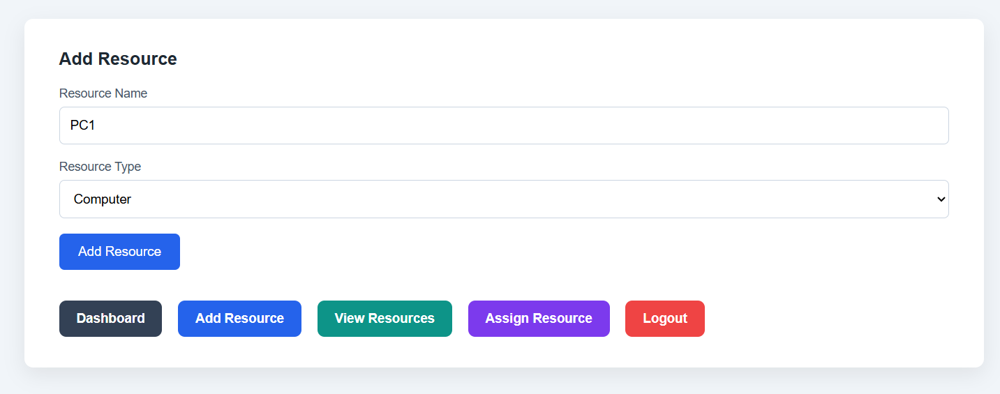
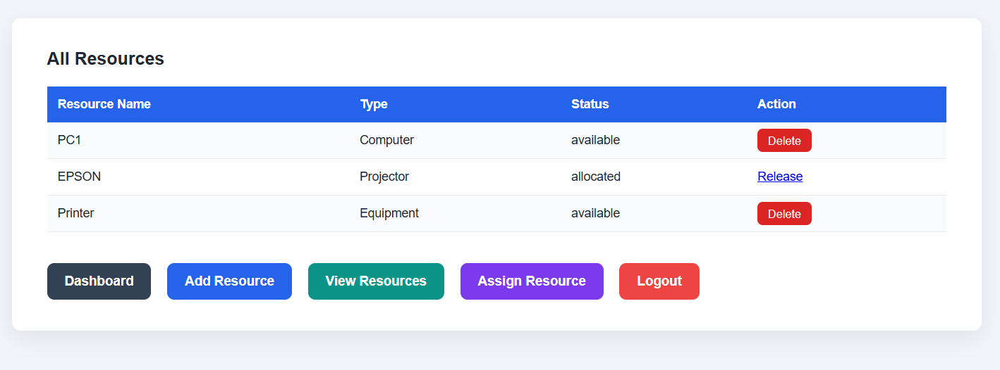
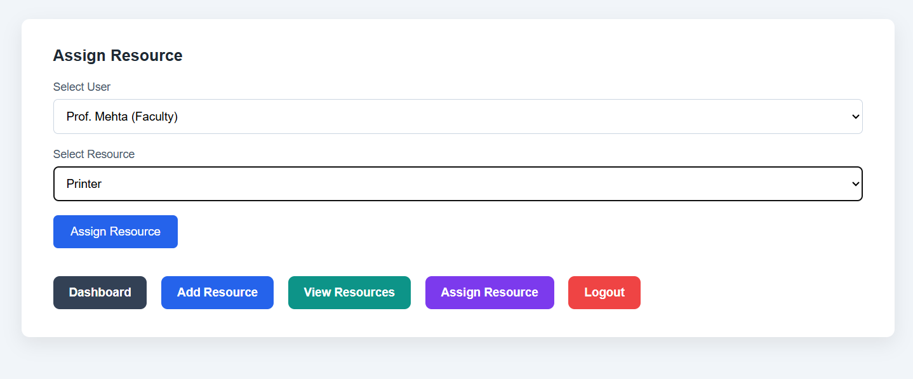

# 📘 Lab Resource Management System

**Complete Project Documentation & User Guide**

---

## 1. Introduction

### What is this project?

**Lab Resource Management System** is a simple web-based application designed to manage laboratory resources in educational institutions.

This system helps to manage:

* Computers
* Projectors
* Other lab equipment

The application allows administrators and staff members to:

* Add lab resources
* View all resources
* Assign resources to students or faculty
* Release allocated resources
* Delete unused resources (admin only)

This project is created for **academic purposes** and is suitable for users with **no coding background**.

---

## 2. Problem Statement

In many colleges and institutions, lab resources are managed manually. This causes several problems such as:

* Not knowing which resource is available
* Assigning the same resource to multiple people
* No proper record of resource usage
* Confusion during lab sessions

### Objective of this project:

To build a **simple, clean, and centralized system** that tracks lab resources and their allocation in a structured way.

---

## 3. User Roles in the System

This system has **two types of users**:

### 1. Admin

Admin has full control of the system:

* Can add new resources
* Can delete available resources
* Can assign resources
* Can release resources
* Can view all resources

### 2. Staff

Staff has limited access:

* Can view resources
* Can assign resources
* Can release resources
* ❌ Cannot add or delete resources

> This role separation improves control and prevents unauthorized changes.

---

## 4. Login Credentials

The system uses **simple predefined login credentials** for demonstration purposes.

| Role  | Username | Password |
| ----- | -------- | -------- |
| Admin | admin    | admin123 |
| Staff | staff    | staff123 |

> No signup is required. This is intentional to keep the project simple and academic-friendly.

---

## 5. Technologies Used (Simple Explanation)

| Technology | Purpose                                |
| ---------- | -------------------------------------- |
| Python     | Backend programming language           |
| Flask      | Web framework to build the application |
| HTML       | Structure of web pages                 |
| CSS        | Styling and design                     |
| SQLite     | Lightweight database to store data     |

SQLite is used because it is simple, fast, and does not require any external setup.

---

## 6. Project Folder Structure

```
lab_resource_system/
│
├── app.py
├── database.db
│
├── templates/
│   ├── login.html
│   ├── dashboard.html
│   ├── add_resource.html
│   ├── view_resources.html
│   └── assign_resource.html
│
└── static/
    └── style.css
```

### File Description:

* **app.py** → Main application logic (backend)
* **database.db** → Stores all data (users, resources, allocations)
* **templates/** → HTML pages
* **static/style.css** → Complete UI styling

---

## 7. Database Design

The project uses **three database tables**.

### 1. users table

Stores students and faculty members who receive resources.

| Column | Description        |
| ------ | ------------------ |
| id     | Unique user ID     |
| name   | Name of the user   |
| role   | Student or Faculty |

---

### 2. resources table

Stores all lab resources.

| Column        | Description                      |
| ------------- | -------------------------------- |
| id            | Resource ID                      |
| resource_name | Name of the resource             |
| resource_type | Computer / Projector / Equipment |
| status        | Available / Allocated            |

---

### 3. allocations table

Stores allocation records.

| Column        | Description                  |
| ------------- | ---------------------------- |
| id            | Allocation ID                |
| user_id       | Reference to users table     |
| resource_id   | Reference to resources table |
| assigned_date | Date of allocation           |

---

Short, honest answer: **NAHI.**
Main README me **users add karne ka process explicitly nahi likha tha**.
Aur achha hua tune notice kiya — **yeh ek important gap tha**, especially non-coder ke liye.

Ab main **exact ready-to-paste section** de raha hoon jo tu README me add karega.
Language **simple English**, non-coder friendly.

---

## ✅ README ADDITION: *How to Add Users (Students / Faculty)*

👉 **Is section ko README me add kar de**
Best place: **Database Design ke baad** ya **Assign Resource module se pehle**.

---

### 🔹 How to Add Users (Students / Faculty)

In this system, **users are the people who receive lab resources**, such as:

* Students
* Faculty members

These users are **not login users**.
They are only used for **resource assignment**.

---

### 🔸 Method 1: Adding Users Using SQLite (Recommended & Simple)

This method does **not require coding knowledge**.

#### Step 1: Open Command Prompt / Terminal

Go to the project folder where `database.db` exists.

#### Step 2: Open SQLite database

Run the following command:

```
sqlite3 database.db
```

#### Step 3: Insert users using simple commands

```sql
INSERT INTO users (name, role) VALUES ('Ali', 'Student');
INSERT INTO users (name, role) VALUES ('Sara', 'Student');
INSERT INTO users (name, role) VALUES ('Prof. Khan', 'Faculty');
INSERT INTO users (name, role) VALUES ('Prof. Mehta', 'Faculty');
```

#### Step 4: Exit SQLite

```
.exit
```

After this, refresh the **Assign Resource** page.
The newly added users will appear in the dropdown list.

---

### 🔸 Important Notes About Users

* Users are **stored in the database**
* Users do **not log in** to the system
* Only **Admin and Staff** can log in
* Users are used **only for resource allocation**

---

### 🔸 Why Is There No “Add User” Page?

This project is designed to be **simple and beginner-friendly**.

Adding a separate “Add User” page was avoided because:

* The main focus is **resource management**
* User data is minimal (name + role)
* It keeps the system clean and easy to understand

> Users can be added easily using the database when needed.

---

## 8. Application Workflow

1. User opens the website
2. Login page appears
3. User logs in as Admin or Staff
4. Dashboard is displayed
5. User performs actions based on role
6. Logout returns the user to login page

---

## 9. Dashboard Module

The dashboard provides a **quick summary** of the system.

### Dashboard Displays:

* Total number of resources
* Number of available resources
* Number of allocated resources

This helps users understand the overall lab status at a glance.

---

## 10. Add Resource Module (Admin Only)

Admin can:

* Enter resource name
* Select resource type
* Submit the form

System automatically:

* Stores the resource in the database
* Sets status as **Available**

Staff users do not have access to this page.

---

## 11. View Resources Module

This page shows:

* All resources
* Their types
* Current status

### Actions available:

* **Release** → Free an allocated resource
* **Delete** → Remove an available resource (admin only)

Allocated resources cannot be deleted to maintain data integrity.

---


## 12. Assign Resource Module

Steps:

1. Select a student or faculty
2. Select an available resource
3. Click assign

System actions:

* Marks resource as allocated
* Stores allocation record in database

This prevents double allocation of the same resource.

---

## 13. Delete Resource Feature (Admin Only)

Rules:

* Only admin can delete resources
* Allocated resources cannot be deleted
* Only available resources can be removed

This ensures system safety and proper data handling.

---

## 14. User Interface Design

The UI is designed to be:

* Clean
* Professional
* Easy to understand
* Suitable for non-technical users

### Button Color Logic:

* Dashboard → Dark Slate
* Add Resource → Blue
* View Resources → Teal
* Assign Resource → Purple
* Delete / Logout → Red

---

## 15. How to Run the Project (Step-by-Step)

### Step 1: Install Python

Install Python version 3.x on your system.

### Step 2: Install Flask

```
pip install flask
```

### Step 3: Run the Application

```
python app.py
```

### Step 4: Open Browser

```
http://127.0.0.1:5000
```

---

## 16. Sample Use Case

A lab has 15 computers.

* Admin logs in
* Adds all computers
* Staff assigns a computer to a faculty
* Status changes to allocated
* Later, staff releases the computer
* Status becomes available again

This avoids confusion and manual tracking.

---

## 17. Conclusion

This Lab Resource Management System:

* Solves a real-world college problem
* Is easy to use
* Has role-based control
* Is beginner-friendly
* Is suitable for academic submission

---

## 18. Future Scope (Optional)

* Allocation history page
* Reports generation
* Student login system
* Notification system

---

# ❓ Frequently Asked Questions (FAQ)

### Q1. Why is Flask used?

Flask is lightweight, simple, and perfect for beginner-level projects.

### Q2. Why SQLite database?

SQLite does not require installation and is easy to manage for small projects.

### Q3. Why are login credentials hardcoded?

This project focuses on functionality, not security, and is designed for academic use.

### Q4. Can students log in?

No. Students are only resource receivers, not system users.

### Q5. Why can’t allocated resources be deleted?

To prevent data inconsistency and accidental data loss.

### Q6. Can this project be extended?

Yes. Reports, charts, and additional roles can be added later.

### Q7. Is this project suitable for beginners?

Yes. It is designed with simple logic and clean structure.

### Q8. Does this system prevent double allocation?

Yes. Only available resources can be assigned.

### Q9. Can staff add resources?

No. Only admin has permission to add or delete resources.

### Q10. Is this project production-ready?

No. It is meant for academic and learning purposes.

---

## ⭐ Final Note

This project focuses on:
**Clarity, simplicity, and real-world usability**, not complexity.

It is ideal for:

* College submissions
* Mini projects
* Viva demonstrations

---

Theek.
Main **2 kaam ek saath** kar raha hoon, clearly aur clean way me:

1️⃣ **Tera poora Hinglish README ko PROPER, polished, professional Markdown me rewrite**
2️⃣ **Exactly bataunga images KAHAN aur KAISE daalne hain** (with example)

Tu **direct copy-paste** kar sakta hai. No extra thinking.

---

# ✅ PART 1: CLEAN & PROFESSIONAL HINGLISH README (FINAL)

👉 **Isko seedha README.md me paste kar**
👉 Headings, spacing, bullets sab GitHub-friendly hain

---

```md
## 🔁 Simplified Explanation (Hinglish Version for Indian Students)

This section explains the same project in **simple Hinglish language**,  
especially for Indian students who are **new to web development** and **non-coders**.

Agar aapko sirf itna pata hai ki **Python, Flask, HTML, CSS** kya hote hain  
lekin yeh kaise kaam karte hain nahi pata — toh yeh section aapke liye hai.

---

# 📘 LAB RESOURCE MANAGEMENT SYSTEM  
### (Complete Project Documentation & User Guide – Hinglish)

---

## 1️⃣ INTRODUCTION

### Yeh project kya hai?

**Lab Resource Management System** ek simple web application hai  
jo college ke laboratory resources ko manage karne ke liye banaya gaya hai.

Is system ka use karke hum:

- Lab ke computers  
- Projectors  
- Other lab equipment  

ko **track**, **assign**, **release**, aur **delete** kar sakte hain.

Yeh project specially **educational institutions** ke liye design kiya gaya hai  
jahan resources manually manage karne me confusion hota hai.

---

## 2️⃣ PROBLEM STATEMENT

Normally college labs me:

- Yeh clear nahi hota kaunsa resource available hai  
- Kaunsa resource kisi student ya faculty ko diya gaya hai  
- Galti se same resource do logon ko assign ho jaata hai  
- Record maintain karna difficult hota hai  

Is project ka main goal hai:

> **Lab resources ka ek central system banana jisse availability, allocation aur control easily ho sake.**

---

## 3️⃣ WHO CAN USE THIS SYSTEM?

Is system ko use karne ke liye **coding knowledge zaroori nahi** hai.

### User Types:

### 🔹 1️⃣ Admin
- System ka full control hota hai  
- Resource add kar sakta hai  
- Resource delete kar sakta hai  
- Resource assign aur release kar sakta hai  

### 🔹 2️⃣ Staff
- Resources dekh sakta hai  
- Resource assign aur release kar sakta hai  
- ❌ Resource add ya delete nahi kar sakta  

> Yeh role separation system ko secure aur professional banata hai.

---

## 4️⃣ TECHNOLOGY USED (Simple Explanation)

| Technology | Use |
|-----------|-----|
| **Python** | Backend logic ke liye |
| **Flask** | Python ko website banane ke liye |
| **HTML** | Website ka structure |
| **CSS** | Website ka design |
| **SQLite** | Database (data store karne ke liye) |

> SQLite ek lightweight database hai jo beginners ke liye best hota hai.

---

## 5️⃣ PROJECT STRUCTURE (Folder Explanation)

```

lab_resource_system/
│
├── app.py
├── database.db
│
├── templates/
│   ├── login.html
│   ├── dashboard.html
│   ├── add_resource.html
│   ├── view_resources.html
│   └── assign_resource.html
│
└── static/
└── style.css

````

### Files ka kaam:

- **app.py** → poore system ka brain  
- **database.db** → saara data yahan store hota hai  
- **templates/** → website ke pages  
- **static/style.css** → website ka design  

---

## 6️⃣ DATABASE DESIGN (VERY SIMPLE)

Is project me **sirf 3 tables** hain.

### 🔹 users table
Students aur faculty jinko resources assign hote hain.

| Column | Description |
|------|-------------|
| id | Unique user ID |
| name | User ka naam |
| role | Student / Faculty |

---

### 🔹 resources table
Lab ke saare resources.

| Column | Description |
|-------|-------------|
| id | Resource ID |
| resource_name | Resource ka naam |
| resource_type | Computer / Projector / Equipment |
| status | Available / Allocated |

---

### 🔹 allocations table
Kaunsa resource kis user ko diya gaya.

| Column | Description |
|-------|-------------|
| id | Allocation ID |
| user_id | User reference |
| resource_id | Resource reference |
| assigned_date | Date |

---

## 7️⃣ LOGIN SYSTEM (Simple but Professional)

### Login Credentials:

| Role | Username | Password |
|----|---------|----------|
| Admin | admin | admin123 |
| Staff | staff | staff123 |

### Login Flow:
1. Website open karo  
2. Login page dikhega  
3. Username aur password daalo  
4. Dashboard open hoga  
5. Logout karne pe login page wapas  

---

## 🔹 Users kaise add kare? (Students / Faculty)

Users ka matlab hai **students aur faculty** jinko lab resources assign kiye jaate hain.  
⚠️ Yeh users **login nahi karte**.

### Method: SQLite Database se Users add karna

#### Step 1: Terminal open karo  
Project folder me jao jahan `database.db` file hai.

#### Step 2: SQLite open karo
```bash
sqlite3 database.db
````

#### Step 3: Users add karo

```sql
INSERT INTO users (name, role) VALUES ('Ali', 'Student');
INSERT INTO users (name, role) VALUES ('Sara', 'Student');
INSERT INTO users (name, role) VALUES ('Prof. Khan', 'Faculty');
INSERT INTO users (name, role) VALUES ('Prof. Mehta', 'Faculty');
```

#### Step 4: Exit

```sql
.exit
```

Assign Resource page refresh karo — users dropdown me dikhne lagenge.

---

## 8️⃣ DASHBOARD EXPLANATION

Dashboard ek **summary view** deta hai:

* Total Resources
* Available Resources
* Allocated Resources

Admin aur Staff dono ke liye useful.

---

## 9️⃣ ADD RESOURCE MODULE (Admin only)

Admin:

* Resource name enter karta hai
* Resource type select karta hai
* Submit karta hai

System:

* Resource database me save karta hai
* Status = Available set karta hai

---

## 🔟 VIEW RESOURCES MODULE

Is page pe:

* Saare resources list hote hain
* Status dikhta hai
* Actions available hote hain

Actions:

* **Release** → resource free karna
* **Delete** → sirf admin, sirf available resource

---

## 1️⃣1️⃣ ASSIGN RESOURCE MODULE

Steps:

1. User select karo
2. Available resource select karo
3. Assign button click karo

System resource ko **Allocated** mark karta hai.

---

## 1️⃣2️⃣ HOW TO RUN THIS PROJECT

```bash
pip install flask
python app.py
```

Browser me open karo:

```
http://127.0.0.1:5000
```

---

## ⭐ FINAL NOTE

Yeh project **show-off ke liye nahi**,
**real system samajhne ke liye** banaya gaya hai.

> **Simple + Clean + Logical = Best academic project**

## 📸 Application Screenshots

### Login Page


### Dashboard


### Add Resource (Admin Only)


### View Resources


### Assign Resource

